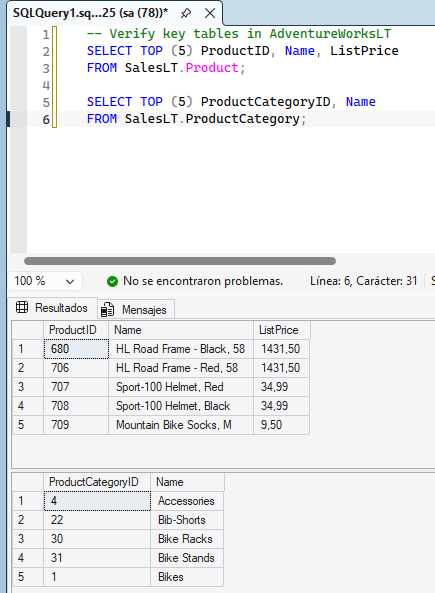
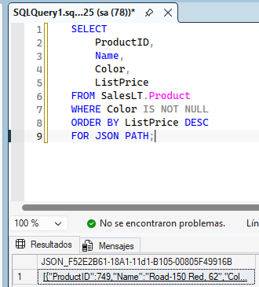
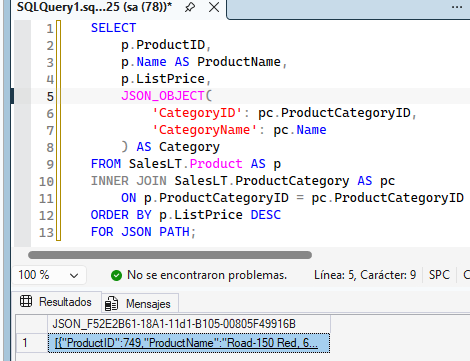
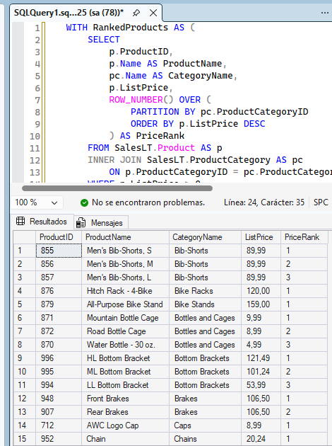
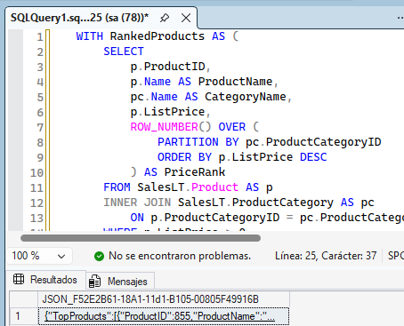
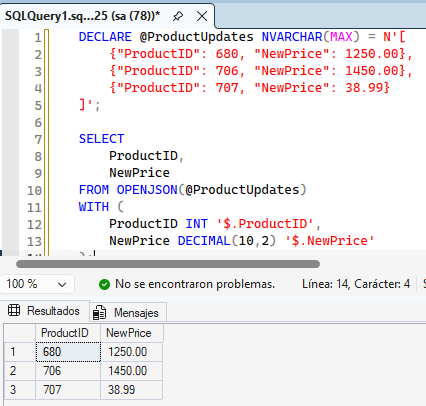
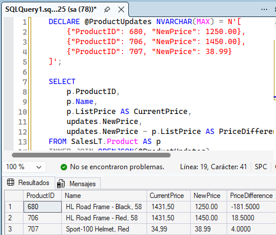

# Consultas avanzadas en T-SQL

## Conectar a AdventureWorksLT

Verificamos que la conexion es adecuada.

## Generar salida JSON a partir de datos de productos

El equipo de marketing necesita información de los productos en formato JSON para un catálogo web. Para empezar, crea un objeto JSON sencillo a partir de la tabla Product.

### Crear un objeto JSON para cada producto

Usa FOR JSON PATH para convertir cada fila de la tabla Product en un elemento JSON.

### Crear JSON anidado con categorías de productos

Añade la información de la categoría como un objeto anidado dentro del JSON.

## Combinar JSON con una CTE y una función de ventana

Ahora crea un informe más útil que clasifique los productos por precio dentro de cada categoría y los exporte en formato JSON.

### Crear una CTE con clasificación mediante función de ventana

Primero, desarrolla la lógica de la consulta usando una CTE y ROW_NUMBER().

### Obtener los productos clasificados en formato JSON

Añade FOR JSON PATH para preparar la salida en formato adecuado para una API.

## Analizar datos JSON con OPENJSON

Ahora practica la lectura de datos JSON y conviértelo de nuevo en filas usando OPENJSON.

### Convertir un array JSON en filas

Supongamos que recibes actualizaciones de productos en formato JSON. Usa OPENJSON para transformarlas en una tabla.

### Unir los datos JSON procesados con los datos existentes

Combina los datos JSON con la tabla Product para comparar el precio actual y el nuevo.

